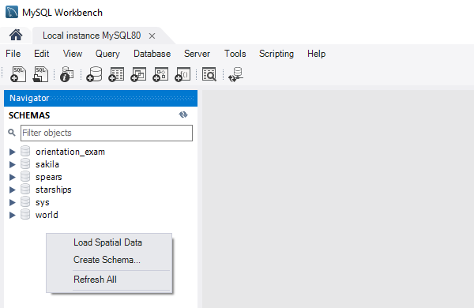
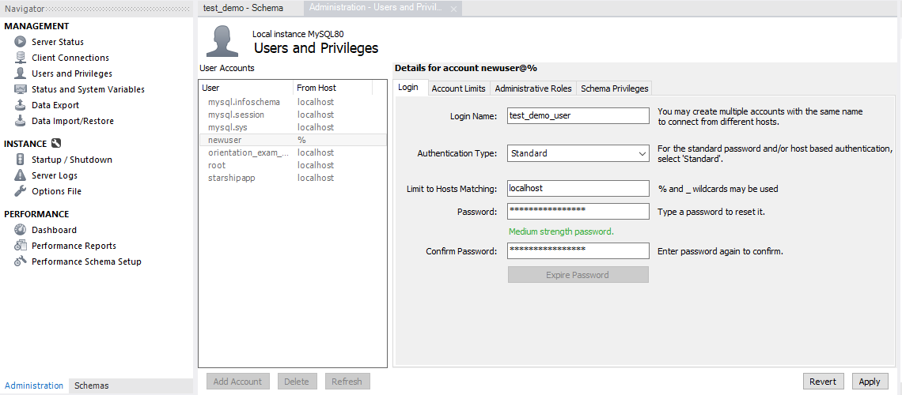
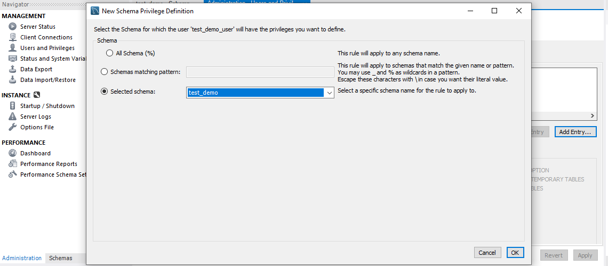
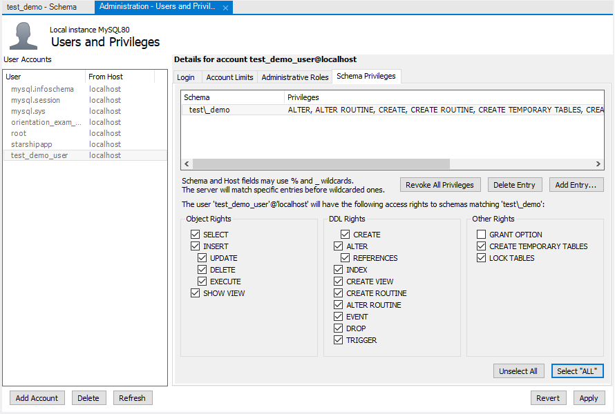
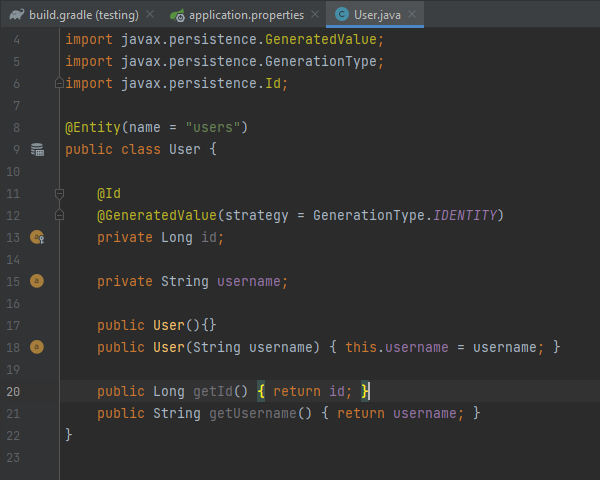

- [Rest Testing](#rest-testing)
  - [Automated Tests](#automated-tests)
    - [Unit Testing](#unit-testing)
    - [Integration Testing](#integration-testing)
    - [Other types](#other-types)
    - [Mocking](#mocking)
- [Demo](#demo)
  - [Controllers](#controllers)
  - [DTOs](#dtos)
  - [Models](#models)
  - [Repositories](#repositories)
    - [Services](#services)
    - [User Service](#user-service)
    - [Food Service](#food-service)
  - [Postman](#postman)
    - [index](#index)
    - [store](#store)
- [Tests](#tests)
  - [Unit Tests](#unit-tests)
    - [AAA](#aaa)
      - [Arrange](#arrange)
      - [Act & Assert](#act--assert)
  - [Integration Tests](#integration-tests)
    - [Controller Endpoints](#controller-endpoints)
    - [Errors](#errors)
  - [Test Database](#test-database)
    - [In-Memory](#in-memory)
  - [Slicing (WebMvcTest)](#slicing-webmvctest)
  - [Database Refresh](#database-refresh)

# Rest Testing

The purpose of writing automated tests is not only to verify the functionality of the current code, but also to be able
to easily and quickly verify that future changes (refactoring) and/or new features do not break the code that's already 
been written.

## Automated Tests

Automated testing is a maintenance and code development which can execute and simulate predefined application behavior, 
compare results with the expected output and create reports of successful and unsuccessful tests. Once created, 
automated tests can be easily and quickly repeated at any moment, saving time and reducing software development costs, 
improving accuracy (even the best tester sometimes makes minor errors) and allowing developers to perform tests which 
cannot be performed manually (e.g. simulation of hundreds / thousands of requests / users, etc.)

### Unit Testing

Unit testing is a type of testing in which individual parts of the code (called "units") are tested whether they work 
according to the exact specification / requirements / design. The primary purpose of unit testing is to test each 
function (unit) separately = isolated from its dependencies.

### Integration Testing

On the other hand, Integration testing is a type of testing in which a group of units is tested, especially whether the 
whole module / system works exactly according to the specified functional requirements.

### Other types

Other types of tests include:
- End-to-end (E2E)
- Stress
- Security
- Performance
- Black box
- White box
- Smoke (aka build verification / confidence testing)

### Mocking

Mocking is a process used in testing when the unit being tested has external dependencies. The purpose of mocking is to 
isolate and focus on the code being tested and not on the behavior or state of external dependencies.

# Demo

*NOTE*: This entire section can be skipped

Let's create a new application called Testing with the following dependencies:
- Developer Tools > Spring Boot DevTools
- Web > Spring Web
- SQL > Spring Data JPA
- SQL > H2 Database
- SQL > MySQL Driver

Then, setup a `test_demo` MySQL database using MySQL Workbench,



create a `test_demo_user` for it,



and set the user permission




Finally, let's add the details to the `application.properties`

```text
server.port=8080
spring.jpa.show-sql=true
spring.jpa.properties.hibernate.format_sql=true

spring.datasource.url=jdbc:mysql://localhost/test_demo?serverTimezone=UTC
spring.datasource.username=test_demo_user
spring.datasource.password=K4gEbw8c2qM4JESg
spring.jpa.hibernate.ddl-auto=update
spring.jpa.properties.hibernate.dialect=org.hibernate.dialect.MySQL5Dialect
spring.logging.level.org.hibernate.SQL=debug
```

## Controllers

This will be a very simple REST application and for that we need a controller to handle the requests:

```java
@RestController
@RequestMapping("/api/foods")
public class FoodController {

    @GetMapping
    public ResponseEntity<List<Food>> index(){
        return null;
    }

    @PostMapping
    public ResponseEntity<List<Food>> store(){
        return null;
    }
}
```

The `index` method should just return a list of existing foods in the dabatase, so let's quickly implement that:

```java
@RestController
@RequestMapping("/api/foods")
public class FoodController {

    private final FoodService foodService;

    @Autowired
    public FoodController(FoodService foodService) {
        this.foodService = foodService;
    }

    @GetMapping
    public ResponseEntity<List<Food>> index(){
        
        List<Food> foods = foodService.findAll();
        return new ResponseEntity<>(foods, HttpStatus.OK);;
    }
    
}
```

To implement the `store` method we'll need a way to process a request which sends the Food (JSON) data an convert it 
into the Food model. The framework can do this automatically via the `@RequestBody` annotation, i.e

```java
@RestController
@RequestMapping("/api/foods")
public class FoodController {

    // ...

    @PostMapping
    public ResponseEntity<List<Food>> store(@RequestBody Food food) {
        // ...
    }
}
```

## DTOs

... but we'll do it in a more flexible way using Data Transfer Objects (DTOs).

```java
package com.greenfox.testing.dtos;

public class FoodDto {
    
    public final String name;
    public final Integer calories;
    public final LocalDateTime addedAt;

    public FoodDto(String name, Integer calories, String addedAt) {
        this.name = name;
        this.calories = calories;

        LocalDateTime ldt = null;
        try {
            DateTimeFormatter formatter = DateTimeFormatter.ofPattern("yyyy-MM-dd HH:mm:ss");
            ldt = LocalDateTime.parse(addedAt, formatter);
        }
        catch (Exception ignored){
        }
        this.addedAt = ldt;
    }
}
```

One advantage of using the DTOs in this way is the ability to define the error handling behavior explicitly in our code.
For example, we may not care if the "calories" has an invalid value and simply set it to 0. Similarly, if the "addedAt" 
value is not a valid data string, we could just give it the "now" value.

Using the Dto allows us to write a clean and short `store` method

```java
@RestController
@RequestMapping("/api/foods")
public class FoodController {

    // ...

    @PostMapping
    public ResponseEntity<List<Food>> store(@RequestBody FoodDto dto){

        List<Food> foods = new ArrayList<>();
        try {
            foods.add(foodService.add(dto));
        }
        catch (Exception unused){
            return ResponseEntity.noContent().build();
        }
        return new ResponseEntity<>(foods, HttpStatus.OK);
    }
}
```

## Models

Next we'll add the User 

```java
package com.greenfox.testing.models;

@Entity(name = "users")
public class User {

    @Id
    @GeneratedValue(strategy = GenerationType.IDENTITY)
    private Long id;

    private String username;

    public User(){}
    public User(String username) { this.username = username; }

    public Long getId() { return id; }
    public String getUsername() { return username; }
    
}
```

and the Food models

```java
package com.greenfox.testing.models;

@Entity(name = "foods")
public class Food {
    
    @Id
    @GeneratedValue(strategy = GenerationType.IDENTITY)
    private Long id;
    
    private String name;
    private Integer calories;
    private LocalDateTime addedAt;
    
    @ManyToOne
    private User user;

    public Food(){}
    public Food(FoodDto dto) {
        this.name = dto.name;
        this.calories = dto.calories;
        this.addedAt = dto.addedAt;
    }

    public Long getId() { return id; }
    public String getName() { return name; }
    public Integer getCalories() { return calories; }
    public LocalDateTime getAddedAt() { return addedAt; }
    public User getUser() { return user; }
    
    public void setAddedAt(LocalDateTime addedAt) { this.addedAt = addedAt; }
    public void setUser(User user) { this.user = user; }

}
```

## Repositories

Next we need the repositories

```java
package com.greenfox.testing.repositories;

import com.greenfox.testing.models.User;
import org.springframework.data.jpa.repository.JpaRepository;
import org.springframework.stereotype.Repository;

@Repository
public interface UserRepository extends JpaRepository<User, Long> {}
```

```java
package com.greenfox.testing.repositories;

import com.greenfox.testing.models.Food;
import org.springframework.data.jpa.repository.JpaRepository;
import org.springframework.stereotype.Repository;

@Repository
public interface FoodRepository extends JpaRepository<Food, Long> { }
```

### Services

... and services with a very simple set of methods

```java
package com.greenfox.testing.services;

import com.greenfox.testing.models.Food;
import org.springframework.stereotype.Service;

import java.util.List;

@Service
public interface FoodService {

    Food add(FoodDto dto);
    List<Food> findAll();    
    
}
```

```java
package com.greenfox.testing.services;

import com.greenfox.testing.models.User;
import org.springframework.stereotype.Service;

import java.util.Optional;

@Service
public interface UserService { 
    
    Optional<User> getCurrentUser();
}
```

### User Service

Now, let's implement the User service first

```java
@Service
public class DatabaseUserService implements UserService {

    private final UserRepository userRepository;

    @Autowired
    public DatabaseUserService(UserRepository userRepository) {
        this.userRepository = userRepository;
    }

    @Override
    public Optional<User> getCurrentUser() {

        return Optional.of(getOrCreateUser());
    }

    private User getOrCreateUser() {

        Optional<User> optionalUser = userRepository.findById(1L);
        return optionalUser.orElseGet(() -> userRepository.save(new User("John Doe")));
    }
}
```

Basically, what the User service does is it returns the first user in the database to be used throughout the 
application. If there are no users in the DB a new user is created (and then returned).

### Food Service

Next, let's implement the Food Service. The `findAll` method is easy - we just use the repository `findAll` method. 

For the `add` method we'll add some error checking / data validation. The best place for this is the service. The controller 
should not really be responsible for these checks; Controllers' sole responsibility is to process requests and return 
responses.

```java
@Service
public class DatabaseFoodService implements FoodService {

    private final FoodRepository foodRepository;
    private final UserService userService;

    @Autowired
    public DatabaseFoodService(FoodRepository foodRepository, UserService userService) {
        this.foodRepository = foodRepository;
        this.userService = userService;
    }

    @Override
    public Food add(FoodDto dto) {

        if (dto == null){
            throw new IllegalArgumentException("Food data must not be null");
        }

        Food food = new Food(dto);
        if (food.getName().isEmpty()){
            throw new IllegalArgumentException("Food name is required");
        }
        if (food.getCalories() < 0){
            throw new IllegalArgumentException("Food calories must be non-negative");
        }

        Optional<User> optionalUser = userService.getCurrentUser();
        if (!optionalUser.isPresent()){
            throw new IllegalStateException("User is not logged in");
        }

        food.setAddedAt(LocalDateTime.now(Clock.systemUTC()));
        food.setUser(optionalUser.get());
        return foodRepository.save(food);
    }

    @Override
    public List<Food> findAll() { return foodRepository.findAll(); }
}
```

## Postman

Let's build the application and see what the end-points do using Postman:

### index

`GET http://localhost:8080/api/foods/`

### store

`POST http://localhost:8080/api/foods`

```json
{
    "name": "banana",
    "calories": "90"
}
```

# Tests

Let's have a look at writing tests for this application ...

## Unit Tests

First, we'll add some unit tests for the models. 

To generate the test class for the User model open the model class, and right click on the word "User" in 
"public class User" (or use the "generate" keyboard shortcut, i.e. ALT + INSERT on Windows).



Let's add a very simple test

```java
package com.greenfox.testing.models;

import org.junit.jupiter.api.Test;

import static org.junit.jupiter.api.Assertions.*;

class UserTest {

    @Test
    void create_user(){

        User user = new User("username");

        assertEquals("username", user.getUsername());
        assertNull(user.getId());
    }
}
```

Similar (simple) test(s) can be added to the Food model

```java
class FoodTest {

    @Test
    void create_food(){

        FoodDto dto = new FoodDto("name", 15, "2022-01-01 12:00:00");
        Food food = new Food(dto);

        assertEquals("name", food.getName());
        assertEquals(15, food.getCalories());
        assertEquals("2022-01-01T12:00", food.getAddedAt().toString());
        assertNull(food.getId());
        assertNull(food.getUser());
    }
}
```

as well as the FoodDto

```java
class FoodDtoTest {

    @Test
    void create_food_dto(){

        FoodDto dto = new FoodDto("", 0, "");
        assertEquals("", dto.name);
        assertEquals(0, dto.calories);
        assertNull(dto.addedAt);
    }
}
```

---

### AAA

These were rather simple tests, so let's have a look at something a bit more complex. Let's test the FoodService!

```java
package com.greenfox.testing.services;

class DatabaseFoodServiceTest {

    @Test
    void add(){

        // AAA
        // Arrange
        // Act
        // Assert
    }
}
```

Each test should have the so-called structre:
- Arrange   : code required to setup the specific test
- Act       : code to call the method(s) under test
- Assert    : check that the expectations are met

#### Arrange

*Question*: So what do we need to check that the `add` method work?
*Answer*: We will definitely need the FoodService

```java
package com.greenfox.testing.services;

class DatabaseFoodServiceTest {

    @Test
    void add(){

        // AAA
        // Arrange
        FoodService foodService = new DatabaseFoodService();
        // Act
        // Assert
    }
}
```

Unfortunately, the compiler does not like this code because the DatabaseFoodService requires two constructor parameters:
- FoodRepository
- UserService

*Question*: How can we fix that? 
*Answer*:

One option is to create an instance of FoodRepository and UserService and pass those into the constructor. But that wouldn't be a unit test anymore; it would be an *integration* test because we'd be testing how those three classes (FoodService, UserService and FoodRepository) work in unison. If we want to test solely the `add` method we need to create the dependencies in a way which ensures they work 100% correctly (if the `add` method tests fails, we want to be sure they are not failing because of an issue in a FoodService dependency). 
 
Thanks to the dependency injection we can use fake dependencies (Mock objects) and inject these to the FoodService.

```java
class DatabaseFoodServiceTest {

    @Test
    void add(){

        // AAA
        // Arrange
        FoodRepository fakeFoodRepository = new FakeFoodRepository();
        UserService fakeUserService = new FakeUserService();
        FoodService foodService = new DatabaseFoodService(fakeFoodRepository, fakeUserService);
        // Act
        // Assert

    }
}

class FakeUserService implements UserService {
    
    @Override
    public Optional<User> getCurrentUser() {
        return Optional.of(new User("Test"));
    }
}
```

In this case creating the FakeUserService class is quite simple; we need to implement only one method. 

FoodRepository, on the other hand, would require implenting more than two dozen methods. Instead of writing hundreds of 
lines of code we can use a library such as Mockito, which automatically creates these fake dependencies for us:

```java
class DatabaseFoodServiceTest {

    @Test
    void add(){

        // AAA
        // Arrange
        FoodRepository fakeFoodRepository = Mockito.mock(FoodRepository.class);
        UserService fakeUserService = Mockito.mock(UserService.class);

        FoodDto fakeDto = new FoodDto("Banana", 89, null);
        Food fakeFood = new Food(fakeDto);

        Mockito.when(fakeFoodRepository.save(Mockito.any())).thenReturn(fakeFood);
        Mockito.when(fakeUserService.getCurrentUser()).thenReturn(
                Optional.of(new User("Tester"))
        );
        
        FoodService foodService = new DatabaseFoodService(fakeFoodRepository, fakeUserService);
        // Act
        // Assert

    }
}
```

#### Act & Assert

The FoodService is now ready to be used ...

```java
class DatabaseFoodServiceTest {

    @Test
    void add(){

        // AAA
        // Arrange
        FoodRepository fakeFoodRepository = Mockito.mock(FoodRepository.class);
        UserService fakeUserService = Mockito.mock(UserService.class);

        FoodDto fakeDto = new FoodDto("Banana", 89, null);
        Food fakeFood = new Food(fakeDto);

        Mockito.when(fakeFoodRepository.save(Mockito.any())).thenReturn(fakeFood);
        Mockito.when(fakeUserService.getCurrentUser()).thenReturn(
                Optional.of(new User("Tester"))
        );

        FoodService foodService = new DatabaseFoodService(fakeFoodRepository, fakeUserService);

        // Act
        Food result = foodService.add(fakeDto);

        // Assert
        assertEquals("Banana", result.getName());
        assertEquals(89, result.getCalories());
        assertNull(result.getUser());
        assertNull(result.getAddedAt());

        assertThrows(IllegalArgumentException.class, () -> {
            foodService.add(null);
        });
        assertThrows(IllegalArgumentException.class, () -> {
            foodService.add(new FoodDto("", 0, null));
        });
        assertThrows(IllegalArgumentException.class, () -> {
            foodService.add(new FoodDto("Banana", -100, null));
        });
    }
}
```

We can run this test ... and it pass. Here, we should do one small refector - namely, we should move the tests for 
invalid parameters into their own method

```java
class DatabaseFoodServiceTest {

    // ...

    @Test
    void add_with_illegal_arguments(){

        //Arrange
        FoodService foodService = new DatabaseFoodService(null, null);
        // Act
        // Assert
        assertThrows(IllegalArgumentException.class, () -> {
            foodService.add(null);
        });
        assertThrows(IllegalArgumentException.class, () -> {
            foodService.add(new FoodDto("", 0, null));
        });
        assertThrows(IllegalArgumentException.class, () -> {
            foodService.add(new FoodDto("banana", -1, null));
        });
    }
}
```

Here we don't really need to create any Mocks as the code of the `add` method shouldn't need to use them at all. The 
illegal argument checks are executed before any of the dependencies are used. 

We can test the IllegalStateException like so:

```java
class DatabaseFoodServiceTest {

    // ...

    @Test
    void add_with_invalid_user(){

        UserService fakeUserService = Mockito.mock(UserService.class);

        Mockito.when(fakeUserService.getCurrentUser()).thenReturn(
                Optional.empty()
        );

        FoodService foodService = new DatabaseFoodService(null, fakeUserService);

        assertThrows(IllegalStateException.class, () -> {
            foodService.add(new FoodDto("Banana", 50, null));
        });
    }
}
```

This is another advantage of Mocking. Specifally, it allows us to test edge cases which occur either randomly or are 
very rare. In this particular example, the `getOrCreateUser` method should never return null; in other words, the 
IllegalStateException should never happen. Nevertheless, we can still test that the code can handle it regardless of 
how likely/possible it is.

## Integration Tests

Now, let's have a look at how we can test Controllers, i.e. how JUnit works with Spring's MVC/Web tools. 

### Controller Endpoints

We'll start with controller end-points. First we need to create an HTTP client with which we can make the requests.

```java
package com.greenfox.testing.controllers;

import static org.junit.jupiter.api.Assertions.*;

@SpringBootTest
@AutoConfigureMockMvc
class FoodControllerTest {

    @Autowired
    private MockMvc mvc;

}
```

The `@SpringBootTest` annotation loads the `ApplicationContext` - the central inerface within a Spring application which 
is used for providing configuration information. It impleemtns the BeanFactory interface (for example).

The `@AutoConfigureMockMvc` enables (create) a web layer for testing (an HTTP client, for example). 

```java
@SpringBootTest
@AutoConfigureMockMvc
class FoodControllerTest {

    @Autowired
    private MockMvc mvc;
    
    @Test
    void get_index() throws Exception {
        
        // create a get request to /api/foods
        // check the response is 200(status ok) or 204(no content)
        mvc.perform(MockMvcRequestBuilders.get("/api/foods"))
                .andExpect(status().is2xxSuccessful())
        ;
    }
}
```

Great, this was pretty easy as well. Now let's have a look at the `add` test

```java

import static org.springframework.test.web.servlet.result.MockMvcResultMatchers.jsonPath;
import static org.springframework.test.web.servlet.result.MockMvcResultMatchers.status;
import static org.hamcrest.Matchers.is;

@SpringBootTest
@AutoConfigureMockMvc
class FoodControllerTest {

    // ...

    @Test
    void post_index() throws Exception {

        // create a post request to /api/foods
        // check the response is 200 (status ok)
        mvc.perform(MockMvcRequestBuilders.post("/api/foods")
                        .content("{\"name\":\"banana\",\"calories\":90}")
                        .contentType(MediaType.APPLICATION_JSON)
                )
                .andExpect(status().isOk())
                .andExpect(jsonPath("$[0].id", is(1)))
                .andExpect(jsonPath("$[0].name", is("banana")))
                .andExpect(jsonPath("$[0].calories", is(90)))
        ;
    }
}
```

A few things to explain here:
- the post request requires body content (data) in json format, we provide it using the `.content()` method
- the media type must be set to JSON in the headers using the `.contentType()` method
- we require the response to have the 200 status
- we can use the `jsonPath` method to check the response data (parsed as JSON object)

### Errors

Another test we could write might be for data/input validation

```java
@SpringBootTest
@AutoConfigureMockMvc
class FoodControllerTest {

    // ...
    
    @Test
    void post_index_with_empty_name() throws Exception {

        mvc.perform(MockMvcRequestBuilders.post("/api/foods")
                        .content("{\"name\":\"\",\"calories\":90}")
                        .contentType(MediaType.APPLICATION_JSON)
                )
                .andExpect(status().isNoContent());
    }
}
```

## Test Database

Next let's have a look at the `application.properties` a change the `ddl-auto` value z `create-drop` to `update`

```text
spring.jpa.hibernate.ddl-auto=update
```

Now let's run the `add` test ... it works just fine ... right ...

*Question*: What happens when we run it again?
*Answer*: The test will fail, specifically at the line checking the id 

```text
JSON path "$[0].id"
Expected: is <1>
     but: was <2>
```

*Question*: Can anyone explain why the second test failed?
*Answer*: The second test failed because there was already an entity in the database, so the next value of id couldn't 
be one!

### In-Memory

Now we've arrived at a very important topic - run tests with storage. Never use a production database for testing! 

Let's have a quick look how to setup a test database:

All we have to do is to create a `resources` folder under `src\test` and add a copy of `application.properties` there. 

Whatever settings we add to this file will now affect (only) our tests. For example, we can use the H2 Database for 
testing.

```text
spring.h2.console.enabled=true
spring.jpa.database-platform=org.hibernate.dialect.H2Dialect

spring.datasource.url=jdbc:h2:mem:test;
spring.datasource.username=sa
spring.datasource.password=password
spring.jpa.hibernate.ddl-auto=create-drop
spring.datasource.driver-class-name=org.h2.Driver
spring.logging.level.org.hibernate.SQL=debug
```

p.s. *There is nothing, of course, stopping us from creating a different MySQL database for the tests and using MySQL 
rather than H2.*

Now re-running the same test (post_index) gives as all-green as desired!

Let's see how we can test data in the database (storage). We'll add another "get_index" test

```java
@SpringBootTest
@AutoConfigureMockMvc
class FoodControllerTest {

    // ...

    @Test
    void get_index_with_food() throws Exception {

        // Arrange
        assertEquals(0, foodRepository.count());
        foodRepository.save(new Food(new FoodDto("Banana", 90, "2022-02-09 10:00:00")));
        foodRepository.save(new Food(new FoodDto("Apple", 52, "2022-02-09 10:00:05")));
        assertEquals(2, foodRepository.count());

        // Act & Assert
        mvc.perform(MockMvcRequestBuilders.get("/api/foods"))
                .andExpect(status().isOk())
                .andExpect(jsonPath("$[0].id", is(1)))
                .andExpect(jsonPath("$[0].name", is("Banana")))
                .andExpect(jsonPath("$[0].addedAt", is("2022-02-09T10:00:00")))
                .andExpect(jsonPath("$[1].id", is(2)))
                .andExpect(jsonPath("$[1].name", is("Apple")))
                .andExpect(jsonPath("$[1].addedAt", is("2022-02-09T10:00:05")))
        ;
    }

    // ...
}
```

## Slicing (WebMvcTest)

Another way to test Controllers is using the `@WebMvcTest` annotation. To demonstrate how this option works and when it
is/can be used let's add another endpoint to the FoodController at the path of "/api/foods/dummy"

```java
@RestController
@RequestMapping("/api/foods")
public class FoodController {

    // ...
    
    @GetMapping("dummy")
    public ResponseEntity<List<Food>> dummy(){
        
        List<Food> foods = Arrays.asList(new Food(new FoodDto("Orange", 47, "2022-02-09 10:30:00")));
        return new ResponseEntity<>(foods, HttpStatus.OK);
    }
}
```

This method does not use any dependencies, i.e. it does not use `FoodService` or `UserService`. Therefore, it makes no 
sense to initialize the entire ApplicationContext (which is was @SpringBootTest does).

Let's create another test class FoodControllerWebTest and use `@WebMvcTest` instead of `@SpringBootTest`

```java
@WebMvcTest(FoodController.class)
class FoodControllerWebTest {

    @Autowired
    private MockMvc mvc;
    
    @MockBean
    private FoodService foodService;
    
    @Test
    void dummy() throws Exception {
        
        mvc.perform(MockMvcRequestBuilders.get("/api/foods/dummy"))
                .andExpect(status().isOk())
        ;
    }
}
```

Because `@WebMvcTest` does not create the ApplicationContext we have to define:
- 1) which class we're testing (this is added as the parameter to the annotation)
- 2) all dependencies as beans, using the `@MockBean` annotation, so that they can be registered (in a mock IoC)

If the `FoodController.dummy` method has a dependency, we could use Mockito as before

```java
@RestController
@RequestMapping("/api/foods")
public class FoodController {

    // ...
    
    @GetMapping("dummy")
    public ResponseEntity<List<Food>> dummy(){
        
//        List<Food> foods = Arrays.asList(new Food(new FoodDto("Orange", 47, "2022-02-09 10:30:00")));
        List<Food> foods = foodService.findAll();;
        return new ResponseEntity<>(foods, HttpStatus.OK);
    }
}
```

and then update the dummy test

```java
@WebMvcTest(FoodController.class)
class FoodControllerWebTest {

    @Autowired
    private MockMvc mvc;
    
    @MockBean
    private FoodService foodService;
    
    @Test
    void dummy() throws Exception {
        
        List<Food> foods = Arrays.asList(new Food(new FoodDto("Orange", 47, null)));
        Mockito.when(foodService.findAll()).thenReturn(foods);

        mvc.perform(MockMvcRequestBuilders.get("/api/foods/dummy"))
                .andExpect(status().isOk())
                .andExpect(jsonPath("$[0].name", is("Orange")))
                .andExpect(jsonPath("$[0].calories", is(47)))
        ;
    }
}
```

## Database Refresh

Let's run the entire test suite and ... oh ... it's red ... we get an error from the "post_index" test. However, running just that single test gives all-green. 

*Question*: Can anyone guess what the issue is?
*Answer*: The issue is that the H2 database is refreshed, by default, only when the entire test suite is started. Not for each individual test!  The "post_index" test does not starts with a fresh database. Instead, there are already two entries from the "get_index_with_food" test. Therefore, the id check `.andExpect(jsonPath("$[0].id", is(1)))` fails, because the id of this food is 3, not 1!

We could solve this issue by deleting/refresh the database using the `@BeforeEach`, for example. Nevertheless, an easier and faster solution is to just use the annotation provided for this exact purpose:

```java
@SpringBootTest
@AutoConfigureMockMvc
@DirtiesContext(classMode = DirtiesContext.ClassMode.AFTER_EACH_TEST_METHOD)
class FoodControllerTest {

    // ...
}
```

The `@DirtiesContext` annotation will mark the used database as dirty after each method in this class, and JUnit will
refresh the database completely, before executing the next test.